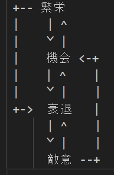

# The Purple (Struggle For Byzantium)

---
## エリア
- 帝国慣習的領土
---
## 終了条件
基本的に終わることはない
- タイトルが破壊されてからn百年経過する
- タイトルが永久的に地図から消える(慣習的領土の変化によって)
---
## 関係勢力
### 人物(実装可能か不明)
- 総主教
- 教皇?

### 宗教
- 正教会
- カトリック
- 使徒教会
- 聖像破壊派
- アシュアリー学派

### 文化
- ビザンツの系統
- ブルガリア
- セルビア
- ボスニア
- クロアチア
- シチリア
- マグリブ
- アルメニア
- グルジア
- アラブの系統(侵入勢力?)
- テュルクの系統(侵入勢力?)
---
## フェイズ

### 繁栄
[パレオロゴス朝ルネサンス](https://ja.wikipedia.org/wiki/%E3%83%91%E3%83%AC%E3%82%AA%E3%83%AD%E3%82%B4%E3%82%B9%E6%9C%9D%E3%83%AB%E3%83%8D%E3%82%B5%E3%83%B3%E3%82%B9)のように、安定した政権では文化的、社会的な繁栄が見込めるはず.
#### 開始条件
- 8割ぐらいの封臣からの意見がプラスの状態である
- 派閥が存在しないこと
#### 終了条件
- 5割ぐらいの封臣からの意見がマイナスの状態である
- 派閥が作成される
- 戦争中
- 皇帝が暴力的な死を迎える(機会へ)

#### 効果
- 戦争
    - 請求権捏造が極めて難しくなる
    - 戦争開始コストが極めて高くなる
    - 請求権要求が極めて難しくなる
- 文化
    - 文化転向にかかる時間が長くなる
- 宗教
    - 改宗にかかる時間が長くなる
- その他
    - 文化の志向の進展が早くなる
    - 建設時間が短くなる
    - より良い客人が訪れやすくなる
    - 名誉、威信が溜まりやすくなる

### 機会
ゲーム中でこの状態が一番長いはず
#### 開始条件
- 封臣との関係悪化
- "高貴な生まれ"を持つ未成年が皇帝になる
- "高貴な生まれ"を持つ女性が皇帝になる
- 好ましくない跡継ぎが皇帝になる?
- "高貴な生まれ"をもたないものが皇帝になる?
#### 終了条件
#### 効果
- イベリアの遺産「同胞」レベル4の共有の諜報(家族間での秘密の共有)が可能になる
- 停戦の購入が可能になる

### 敵意
#### 開始条件
- 有力な封臣とライバルになる
- 皇帝が破門される?
#### 終了条件
- 繁栄フェイズの開始条件を達成する
- 機会フェイズの開始条件を達成する
#### 効果
- 有力な封臣は反乱を起こしがちになる
- 傭兵コストが安くなる
- 宰相の効力が上がる
- 忠実な臣下はより忠実になる?
- 不忠な臣下はより不忠になる?
- 請求権の捏造が容易になる
- スパイ雇用コストが極めて高くなる(全員から嫌われていれば封臣が自動参加するはず)