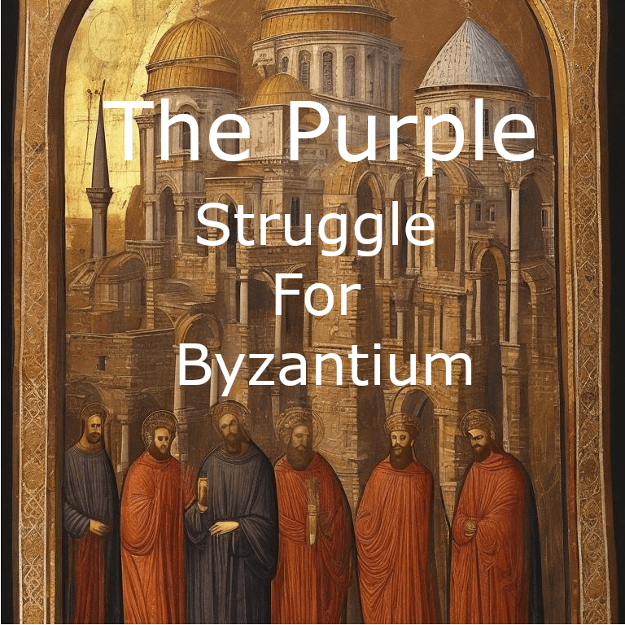

# The Purple (Struggle For Byzantium)

イベリアの闘争のように終わらせないとやりたいことができないということではなく
ゲーム終了までずっと続くものにしたい。
ゲーム終了までプレイしたことがないユーザーが多すぎるからです  
飽きてやめるのではなく、ゲームオーバーでやめざるをえないような難易度に設定する予定です。

---
## エリア
- 東ローマ帝国慣習的領土
---
## 終了条件
AND
- ビザンツ帝国の請求権を誰も持っていない
- ビザンツ帝国のタイトルを誰も持っていない
- ビザンツ帝国のタイトルが破壊されてからN年以上経過している
---
## 関係勢力
### 宗教
- 正教会
- 使徒教会
- 聖像破壊派
- ヘレニズム

### 文化
- ラテン系統
- ビザンツ系統
- 南スラブ系統
---
## フェイズ

### 繁栄
ゲーム中に多くて3回程度訪れるようにする予定。  
極めて多くのバフが乗る。  
君主の死や破門、封臣との関係悪化により短期間で終了する。  
これをどのようにして長く続かせるか（最大70年程度）がゲームの肝になる。  
ここで帝国を発展させることができないと、内戦によって衰退するだろう。
#### 効果
- 戦争
    - 請求権捏造が極めて難しくなる
    - 戦争開始コストが極めて高くなる
    - 請求権要求が極めて難しくなる
- 文化
    - 文化転向にかかる時間が極めて長くなる
- 宗教
    - 改宗にかかる時間が極めて長くなる
- その他
    - 文化の志向の進展が早くなる
    - 建設時間が短くなる
    - より良い客人が訪れやすくなる
    - 名誉、威信が溜まりやすくなる
#### 遷移先
- 衰退: 通常はこちらに遷移する
- 機会: とても良い君主であったならこちらに遷移する

### 機会
ゲーム中でこの状態が一番長い。  
封臣は現在の君主が皇帝に相応しいのかを探る。  
封臣は君主の秘密を積極的に探りに来る。  
#### 効果
- イベリアの遺産「同胞」レベル4の共有の諜報(家族間での秘密の共有)が可能になる
- 停戦の購入が可能になる
#### 遷移先
- 衰退: 通常はこっち
- 繁栄: 伝説的な君主であればこちらに遷移する

### 衰退
繁栄、機会、敵意フェイズに帝国を良い方向に導けなかった場合に遷移する。  
繁栄と真逆でデバフまみれになる。封臣との関係が悪化しやすくなり、これを改善できないと敵意フェイズへ移行する。    
帝国が脆弱になり外国から戦争をふっかけられまくる。  
ここが続くと滅びる。
#### 効果
- いろんなデバフ
#### 遷移先
- 敵意: 通常はこっち
- 機会: とても良い君主であったならこちらに遷移する

### 敵意
帝国の衰退の原因は皇帝その人だろう。  
封臣は積極的に皇帝位を奪還しようとする。  
暗殺まつりになる。  
ここをすぐに脱出しないとほぼ確実に滅びる。(時間がかからずに暗殺されるはず)

#### 効果
- 衰退より軽減されたデバフ
- 有力な封臣は反乱を起こしがちになる
- 傭兵コストが安くなる
- 宰相の効力が上がる
- 忠実な臣下はより忠実になる?
- 不忠な臣下はより不忠になる?
- 請求権の捏造が容易になる
- スパイ雇用コストが極めて高くなる(全員から嫌われていれば封臣が自動参加するはず)

#### 遷移先
- 衰退: 通常はこっち
- 機会: 皇帝が変わったら即座にこっち